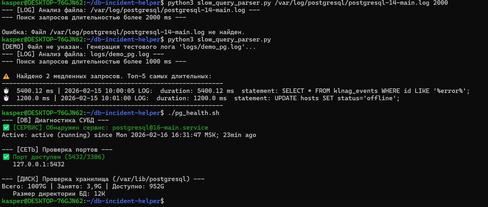

# 🐘 Database Incident Helper


Набор диагностических утилит для инженера **L3 Support**.
Предназначен для экстренной диагностики СУБД (PostgreSQL/MariaDB), используемой в **Kaspersky Security Center (Linux)**. Помогает быстро определить причины недоступности консоли или падения производительности.

---

## 📸 Результат диагностики
*(Демонстрация работы на живом сервере: проверка сервисов и поиск медленных запросов)*



---

## 🛠️ Состав репозитория

### 1. `pg_health.sh` (Bash)
Комплексная проверка "здоровья" инстанса БД.
* **Service Check:** Проверяет статус systemd-юнита (postgresql/mariadb), выводит аптайм.
* **Port Listener:** Использует `ss` для проверки доступности портов 5432/3306 (исключает проблемы фаервола).
* **Disk Usage:** Контролирует свободное место в `/var/lib/postgresql`. Критично для KSC, так как при переполнении диска база аварийно останавливается.

### 2. `slow_query_parser.py` (Python)
Анализатор журналов PostgreSQL (`postgresql-*.log`) для выявления проблем производительности.
* **Log Parsing:** Ищет записи с меткой `duration`, превышающие заданный порог (по умолчанию 1000 мс).
* **Reporting:** Генерирует сводку топ-5 самых "тяжелых" запросов, блокирующих работу приложений.
* **Demo Mode:** При запуске без аргументов генерирует тестовый лог для демонстрации возможностей.

---

## 🚀 Примеры использования

```bash
# 1. Экспресс-диагностика состояния СУБД
sudo ./pg_health.sh

# 2. Поиск запросов медленнее 2 секунд в реальном логе
python3 slow_query_parser.py /var/log/postgresql/postgresql-14-main.log 2000

# 3. Демонстрационный запуск (генерация тестовых данных)
python3 slow_query_parser.py