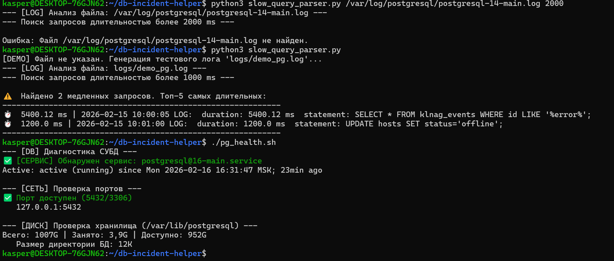

# 🐘 Database Incident Helper


> Этот набор включён в общий тулкит: см. `MIGRATION.md` и `..\enterprise-linux-ops-toolkit`.

Набор утилит для оперативной диагностики СУБД (PostgreSQL/MariaDB) в Enterprise-инфраструктуре. Разработан для локализации причин недоступности сервисов или деградации производительности.

---

## 📸 Результат диагностики
*(Демонстрация работы на живом сервере: проверка сервисов и поиск медленных запросов)*



---

## 🛠 Состав инструментов

### 1. `pg_health.sh`
Скрипт комплексной проверки «здоровья» инстанса БД.
* **Service Analysis**: Проверка статуса в systemd (active/uptime).
* **Port Listener**: Проверка доступности портов (5432/3306) через `ss`.
* **Resource Guard**: Контроль свободного места в `/var/lib/postgresql` для предотвращения аварийной остановки СУБД.

### 2. `slow_query_parser.py`
Анализатор журналов PostgreSQL для выявления «тяжелых» запросов.
* **Pattern Matching**: Поиск запросов, превышающих заданный порог выполнения (SLA).
* **Top-N Reporting**: Формирование отчета из самых длительных запросов для оптимизации индексов.
* **Sandbox Mode**: Автоматическая генерация демо-лога для тестирования инструмента.

## 🚀 Примеры использования
```bash
# Быстрая проверка состояния базы
sudo ./pg_health.sh
```

```bash
# Поиск запросов медленнее 2 секунд в логах
python3 slow_query_parser.py /var/log/postgresql/postgresql-15-main.log 2000
```